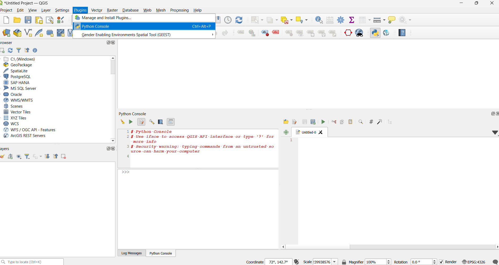
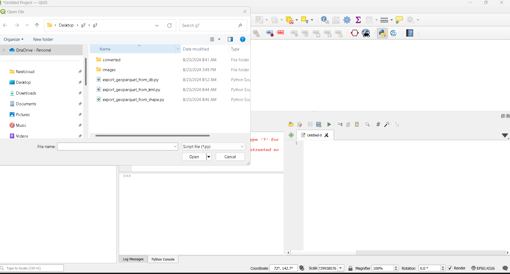
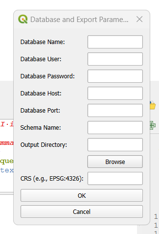
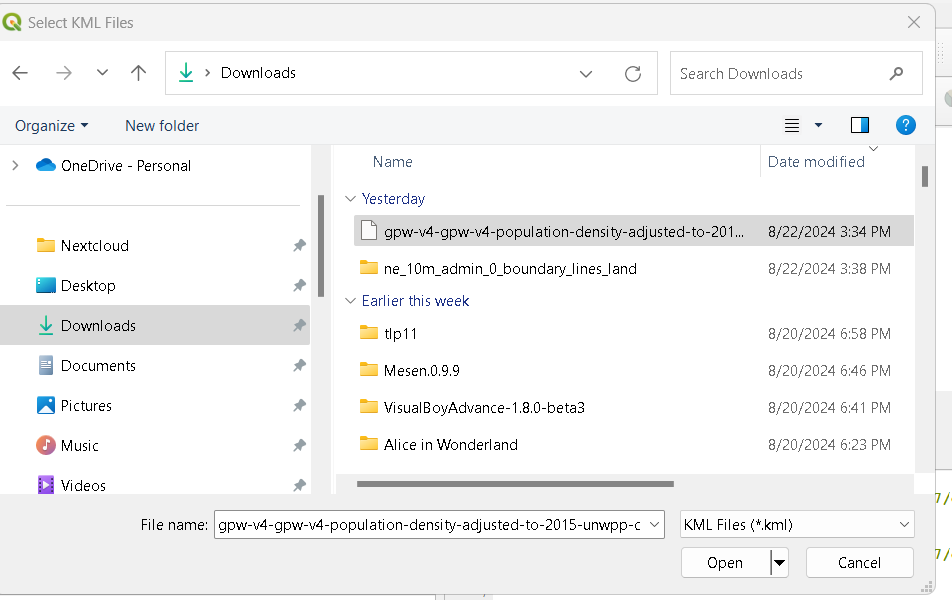
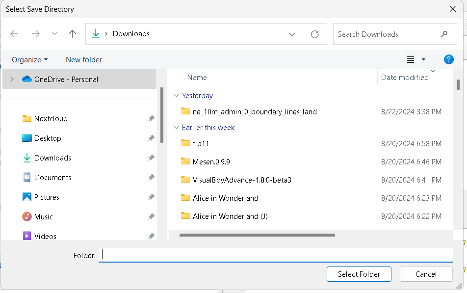

# g7
This repo is to store scripts for converting kml and shape files to geoparquet format

## Convert geoparquet files from database

- Open up QGIS desktop
- In the top navigation bar click on "Plugins", from the dropdown select 'Python Console'

- Select the folder icon to open up a script, import the script called "export_geoparquet_from_db.py"

- Click on the green arrow to run the script
- Enter your database name, host, username, password, port, choose where the exported files should be saved and enter the CRS you wish to convert to and press "OK"

- In the python console you will see an ouput printed telling you whether or not the operation was succesfull

## Convert geoparquet files from kml

- Open up QGIS desktop
- In the top navigation bar click on "Plugins", from the dropdown select 'Python Console'

- Select the folder icon to open up a script, import the script called "export_geoparquet_from_kml.py"

- Click on the green arrow to run the script
- Choose the kml files you would like to convert

- Choose the directory where you would like to store the files

- Enter the CRS you would like to convert to
- Press "OK"
- A message will popup to give feedback on the operation

## Convert geoparquet files from shapefiles

- Open up QGIS desktop
- In the top navigation bar click on "Plugins", from the dropdown select 'Python Console'

- Select the folder icon to open up a script, import the script called "export_geoparquet_from_shape.py"

- Click on the green arrow to run the script
- Choose the directory where the shape files you would like to convert resides

- Choose the directory where you would like to store the files

- Enter the CRS you would like to convert to
- Press "OK"
- A message will popup to give feedback on the operation